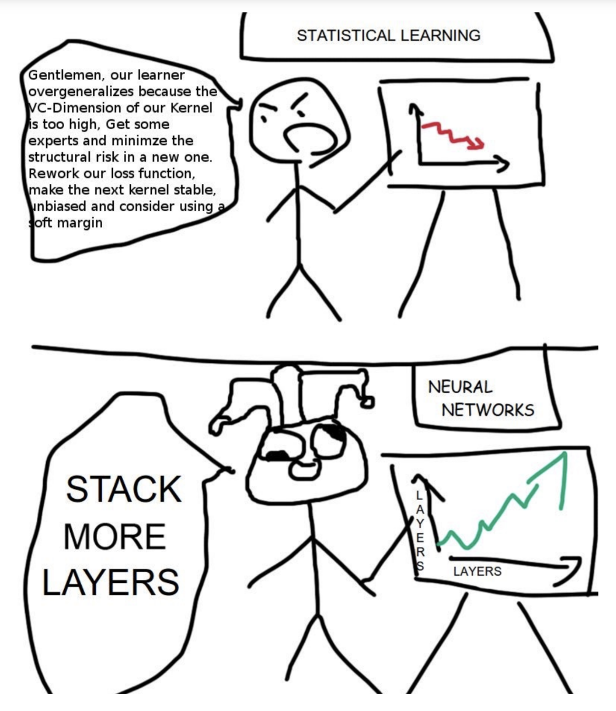

# Deep Learning - Master Big Data, Intelligence Artificielle, *Dauphine-PSL Tunis*

Welcome to the Deep Learning course page. 

## Course 👨🏼‍🎓📖

### Introduction to Deep Learning 
- Course 📚 [link](https://drive.google.com/file/d/1iL5JYNi2gfLReKfLSG7xwW4iKVqrkOjI/view)  
 
### The Perceptron algorithm
- Course 📚 [link](https://drive.google.com/file/d/1PeZA0_R8zIYvfcAD4YzxCkUQR-4P8CN7/view) 
- Practical session 💻  
    🛠️ [exercise](https://drive.google.com/file/d/1TyAhE5VQ373_ZoDagHBDjr24cqFw5OfY/view?usp=sharing)  
    💡 [solution](https://drive.google.com/file/d/1Baota3WZZW-lDw0VEm3FrpCF5JRRtXe-/view)  

### Gradient descent 
- Course 📚 [link](https://drive.google.com/file/d/10pGlP2uixosX4ZP66R_FmsY9GE7Ft0XO/view)  
- Practical session 💻  
    🛠️ [exercise](https://drive.google.com/file/d/1EIfkfmOsUbZXp9OjV4gsuIm4Rq1nKNwD/view?usp=drive_link)  
    💡 [solution](https://drive.google.com/file/d/1A4CSSEaKKq3WXKGNBxJjj_akuA-UtLUI/view?usp=drive_link)  

### Logistic Regression
- Course 📚 [link](https://drive.google.com/file/d/1fhCpgPYATfUIAFOQ1mQyA2Q7qIWnRzoG/view)  
- Practical session 💻  
    🛠️ [exercise](https://drive.google.com/file/d/1XZ_F87BQDSwTnAinyHZgZuGpUixTUsk7/view?usp=drive_link)  
    💡 [solution](https://drive.google.com/file/d/1u0kCHmSLByeEfimA6mARGC8L8rt1nTTu/view?usp=drive_link)  

### Neural Networks (Part 1)
- Course 📚 [link](https://drive.google.com/file/d/16TliiCrmZLSjvRPYrcYTUNU56JUWvAPs/view)  
- Practical session 💻  
    🛠️ [exercise](https://drive.google.com/file/d/1HLVXV1Wrty97-gGY4S2lxbmO5ybWjZNC/view?usp=drive_link)  
    💡 [solution](https://drive.google.com/file/d/11e2eqM-lPrRoWPs2YpdW4io4-q2ZoxRT/view?usp=sharing)  

### Neural Networks: training and validation (Part 2)
- Course 📚 [link](https://drive.google.com/file/d/1psQjlO5yDEGLgaTHikkwzjxvFHatCO6_/view)  

### Neural Networks: speed up the training (Part 3)
- Course 📚 [link](https://drive.google.com/file/d/13f8-YU44dnHKW_8Zy9PzdAuR6vuI5B24/view)   

### Introduction to PyTorch
- Course 📚 [link](https://drive.google.com/file/d/1-rl9gaI7FXW5b87v6vyX1jZzXCEFfeAa/view)   
- Practical session 💻  
    🛠️ [PyTorch tutorial](https://drive.google.com/file/d/1yZ9VD6aGAruVpCr8jI9CcFGYnt-HNV4W/view?usp=drive_link)   
    💡 [solution](https://drive.google.com/file/d/1vfXr6MCZ1FUICz8bk618qh7ugbB3DMO2/view)   

    🛠️ [Neural Networks with PyTorch](https://drive.google.com/file/d/1oKCJ2DRvO-5VOJI-KkLjG9w0SZYnIEKi/view?usp=drive_link)   
    💡 [solution](https://drive.google.com/file/d/1T5iKz8eJtT6UW_AwZr2TKNA8bFQkeay-/view?usp=drive_link)   
    
    🛠️ [Neural Networks with PyTorch Application](https://drive.google.com/file/d/1pwa8DU3Yd_rQ_pVUPuXyGLPOR6OxwECp/view?usp=drive_link)  
    💡 [solution](https://drive.google.com/file/d/1jx-3lUkuDTNLPDVpUXnzh8HYnFvepUrn/view?usp=drive_link)  

### Training a Neural Network: tricks and tips
- Course 📚 [link](https://drive.google.com/file/d/1hPkK6K9vGBCwqWWiEt5yJde_OqNnpltF/view)    
- Practical session 💻 Hyperparameters optimization  
    🛠️ [exercise](https://drive.google.com/file/d/1VkssQVf4rALjwwWgSchFGMi5SXRuypgH/view?usp=drive_link)    
    💡 [solution](https://drive.google.com/file/d/1xxPwmJEbRsRGKH1FolA9rDPiKut2IhJZ/view?usp=drive_link)    

### Introduction au Deep Learning pour l'analyse d'image
- Course 📚 [link](https://drive.google.com/file/d/1-rl9gaI7FXW5b87v6vyX1jZzXCEFfeAa/view)   
- Practical session 💻  
    🛠️ [CNNs with PyTorch](https://drive.google.com/file/d/1ynNSxRKcXrmIuGJDPs0E7AaVsR1dlVNH/view?usp=drive_link)   
    💡 [solution](https://drive.google.com/file/d/1gfklORaKMsAtomFmomQifC9coCRYGyt4/view?usp=drive_link)   
    
    🛠️ [CNNs with PyTorch - Application](https://drive.google.com/file/d/1ePxgLZgSWzmEl3Y8ITmAZgDciR4Qfsaz/view?usp=drive_link)   
    💡 [solution](https://drive.google.com/file/d/1wAuDbvWOsVx-hQ5jBOBWZoLvd3NER72F/view?usp=drive_link)    

### Recurrent Neural Networks and Transformers
- Course 📚 [link](https://drive.google.com/file/d/14EwFqhys0PZHuwKVjRhPZGocMiF8EEQm/view?usp=sharing)   

## Project 📝

The semester final project is an open Kaggle competition available here: [Kaggle competition](https://www.kaggle.com/competitions/house-prices-advanced-regression-techniques/overview).  

All the information related to the project can be found in the following presentation: 
[project presentation](https://drive.google.com/file/d/1SCZ4K05MwoRUe_c0LQnnnlG8bf7Lpj8c/view?usp=drive_link)

🚨 **The deadline for the project is set to 24/10**
