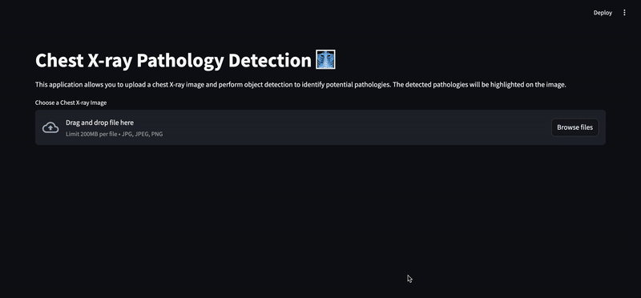

# Chest X-Ray Detection App

<figure>
  
</figure>

Chest X-Ray Detection App is an AI-based application designed to analyze chest X-ray images for various pathologies. Utilizing object detection models, the app can identify and highlight regions of concern in the X-ray images. \
\
The application features an easy-to-use interface where users can upload X-ray images and receive visualized detection results with bounding boxes and prediction scores. This project is powered by FastAPI for backend services and Streamlit for the front-end interface, ensuring a seamless user experience.

The code is available on [ GitHub](https://github.com/hippolytemayard/chest-xray-detection)